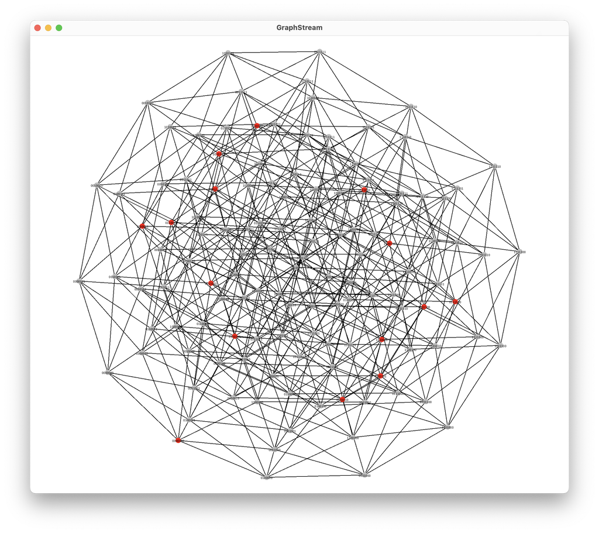

# О программе
Перечисление `(7,16,3)`-кодов с точностью до эквивалентности, доказательство, 
что они являются кодами Хэмминга.

# Результаты
```
Code(words=[1111111, 0111100, 0110011, 1110000, 1001100, 0000000, 1000011, 0101010, 0100101, 0011001, 0010110, 1011010, 1010101, 1101001, 1100110, 0001111])
Code(words=[1111111, 0111100, 0110011, 1110000, 1001100, 0000000, 1000011, 0101001, 0100110, 0011010, 0010101, 1011001, 1010110, 1101010, 1100101, 0001111])
Code(words=[1111111, 0111010, 0110101, 1110000, 1001010, 0000000, 1000101, 0101100, 0100011, 0011001, 0010110, 1011100, 1010011, 1101001, 1100110, 0001111])
Code(words=[1111111, 0111010, 0110101, 1110000, 1001010, 0000000, 1000101, 0101001, 0100110, 0011100, 0010011, 1011001, 1010110, 1101100, 1100011, 0001111])
Code(words=[1111111, 0111001, 0110110, 1110000, 1001001, 0000000, 1000110, 0101100, 0100011, 0011010, 0010101, 1011100, 1010011, 1101010, 1100101, 0001111])
Code(words=[1111111, 0111001, 0110110, 1110000, 1001001, 0000000, 1000110, 0101010, 0100101, 0011100, 0010011, 1011010, 1010101, 1101100, 1100011, 0001111])
Code(words=[1111111, 0111100, 0101011, 1101000, 1010100, 0000000, 1000011, 0110010, 0100101, 0011001, 0001110, 1011010, 1001101, 1110001, 1100110, 0010111])
Code(words=[1111111, 0111100, 0101011, 1101000, 1010100, 0000000, 1000011, 0110001, 0100110, 0011010, 0001101, 1011001, 1001110, 1110010, 1100101, 0010111])
Code(words=[1111111, 0111010, 0101101, 1101000, 1010010, 0000000, 1000101, 0110100, 0100011, 0011001, 0001110, 1011100, 1001011, 1110001, 1100110, 0010111])
Code(words=[1111111, 0111010, 0101101, 1101000, 1010010, 0000000, 1000101, 0110001, 0100110, 0011100, 0001011, 1011001, 1001110, 1110100, 1100011, 0010111])
Code(words=[1111111, 0111001, 0101110, 1101000, 1010001, 0000000, 1000110, 0110100, 0100011, 0011010, 0001101, 1011100, 1001011, 1110010, 1100101, 0010111])
Code(words=[1111111, 0111001, 0101110, 1101000, 1010001, 0000000, 1000110, 0110010, 0100101, 0011100, 0001011, 1011010, 1001101, 1110100, 1100011, 0010111])
Code(words=[1111111, 0111100, 0100111, 1100100, 1011000, 0000000, 1000011, 0110010, 0101001, 0010101, 0001110, 1010110, 1001101, 1110001, 1101010, 0011011])
Code(words=[1111111, 0111100, 0100111, 1100100, 1011000, 0000000, 1000011, 0110001, 0101010, 0010110, 0001101, 1010101, 1001110, 1110010, 1101001, 0011011])
Code(words=[1111111, 0110110, 0101101, 1100100, 1010010, 0000000, 1001001, 0111000, 0100011, 0010101, 0001110, 1011100, 1000111, 1110001, 1101010, 0011011])
Code(words=[1111111, 0110110, 0101101, 1100100, 1010010, 0000000, 1001001, 0110001, 0101010, 0011100, 0000111, 1010101, 1001110, 1111000, 1100011, 0011011])
Code(words=[1111111, 0110101, 0101110, 1100100, 1010001, 0000000, 1001010, 0111000, 0100011, 0010110, 0001101, 1011100, 1000111, 1110010, 1101001, 0011011])
Code(words=[1111111, 0110101, 0101110, 1100100, 1010001, 0000000, 1001010, 0110010, 0101001, 0011100, 0000111, 1010110, 1001101, 1111000, 1100011, 0011011])
Code(words=[1111111, 0111010, 0100111, 1100010, 1011000, 0000000, 1000101, 0110100, 0101001, 0010011, 0001110, 1010110, 1001011, 1110001, 1101100, 0011101])
Code(words=[1111111, 0111010, 0100111, 1100010, 1011000, 0000000, 1000101, 0110001, 0101100, 0010110, 0001011, 1010011, 1001110, 1110100, 1101001, 0011101])
Code(words=[1111111, 0110110, 0101011, 1100010, 1010100, 0000000, 1001001, 0111000, 0100101, 0010011, 0001110, 1011010, 1000111, 1110001, 1101100, 0011101])
Code(words=[1111111, 0110110, 0101011, 1100010, 1010100, 0000000, 1001001, 0110001, 0101100, 0011010, 0000111, 1010011, 1001110, 1111000, 1100101, 0011101])
Code(words=[1111111, 0110011, 0101110, 1100010, 1010001, 0000000, 1001100, 0111000, 0100101, 0010110, 0001011, 1011010, 1000111, 1110100, 1101001, 0011101])
Code(words=[1111111, 0110011, 0101110, 1100010, 1010001, 0000000, 1001100, 0110100, 0101001, 0011010, 0000111, 1010110, 1001011, 1111000, 1100101, 0011101])
Code(words=[1111111, 0111001, 0100111, 1100001, 1011000, 0000000, 1000110, 0110100, 0101010, 0010011, 0001101, 1010101, 1001011, 1110010, 1101100, 0011110])
Code(words=[1111111, 0111001, 0100111, 1100001, 1011000, 0000000, 1000110, 0110010, 0101100, 0010101, 0001011, 1010011, 1001101, 1110100, 1101010, 0011110])
Code(words=[1111111, 0110101, 0101011, 1100001, 1010100, 0000000, 1001010, 0111000, 0100110, 0010011, 0001101, 1011001, 1000111, 1110010, 1101100, 0011110])
Code(words=[1111111, 0110101, 0101011, 1100001, 1010100, 0000000, 1001010, 0110010, 0101100, 0011001, 0000111, 1010011, 1001101, 1111000, 1100110, 0011110])
Code(words=[1111111, 0110011, 0101101, 1100001, 1010010, 0000000, 1001100, 0111000, 0100110, 0010101, 0001011, 1011001, 1000111, 1110100, 1101010, 0011110])
Code(words=[1111111, 0110011, 0101101, 1100001, 1010010, 0000000, 1001100, 0110100, 0101010, 0011001, 0000111, 1010101, 1001011, 1111000, 1100110, 0011110])
```

### Графический пример полученного кода


# Обзор

https://youtu.be/RnbrFYOH0eQ?si=UmtnEcUmiV-LTiM8


# Подготовка
В `gradle.properties` добавить `gpr.user`, `gpr.token` для  
загрузки зависимостей.
